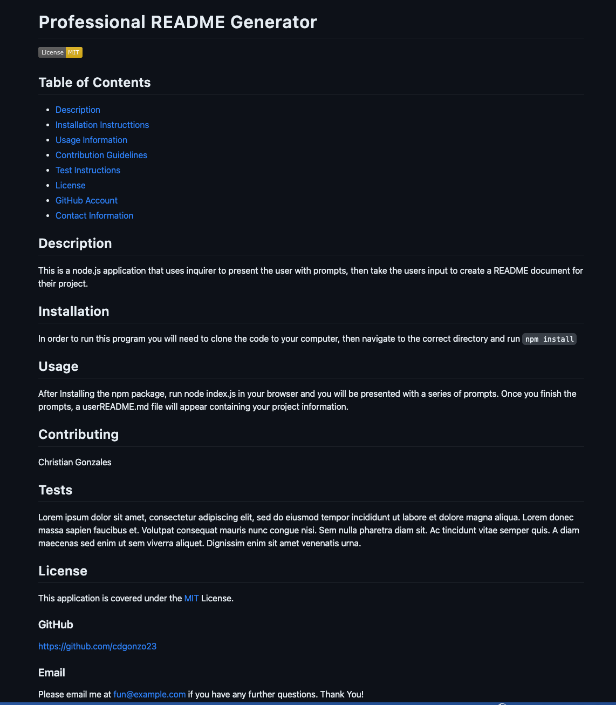

# Professional README Generator
## Description
The purpose of this aplication is to build a custom README based off of the user input folllowing a series of commands. It formats the document as well and builds a table of contents based off of the users input. This program utilizes node.js and inquirer in order to prompt and the user and place the users information in the README.
## Installation
To run this application you will need to first clone the code from this repository, then navigate to the correct directory, and finally run `npm install` in your terminal.
## Usage
Once the npm package has been installed, type `node index.js` in the terminal and you will be presented with a series of prompts whoich will then lead to your generated README.

[Click here](./images/walkthrough.mp4) for a video walkthrough
### Resources
[Github Repo](https://github.com/cdgonzo23)

### Example Screenshot
